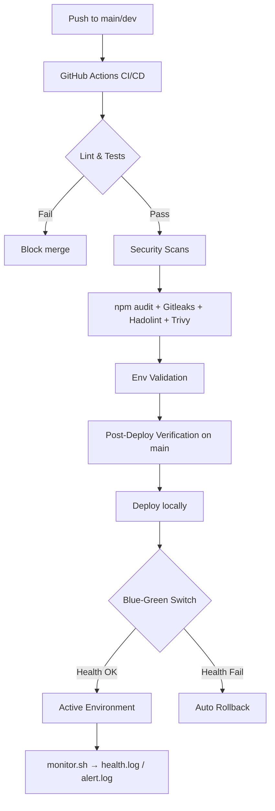

# DevOps Final Project

A unified DevOps solution built by merging the **midterm** (local blue-green deployment, IaC, monitoring) and **pipeline** (CI quality gate, automated testing) assignments, extended with environment automation, security scanning, reliability improvements, and Docker support.

All previously implemented functionality remains operational.

---

## Tech Stack

| Category | Tools |
|----------|-------|
| Application | Node.js, Express |
| Testing | Jest, Supertest |
| Linting | ESLint |
| CI/CD | GitHub Actions |
| Containers | Docker, Docker Compose |
| Process Manager | PM2 (local blue-green) |
| Reverse Proxy | Nginx (Docker blue-green) |
| Security | npm audit, Gitleaks, Hadolint, Trivy |
| IaC / Automation | Bash scripts |

---

## Project Architecture

See [docs/ARCHITECTURE.md](docs/ARCHITECTURE.md) for the full diagram and component breakdown.



---

## Branching Strategy

| Branch | Role |
|--------|------|
| `main` | Production-ready; full CI pipeline + post-deploy checks |
| `dev` | Integration; CI runs on push and pull requests |
| `feature/*` | Feature branches merged into `dev` via PR |

---

## Environment Setup (Single Command)

Everything needed to run the project locally is automated with one command.

### Linux / macOS / Git Bash (Windows)

```bash
git clone <your-repo-url>
cd devops-final
npm run setup
```

This runs `scripts/setup.sh`, which:

1. Installs npm dependencies
2. Creates `.env` from `.env.example`
3. Validates the environment (`scripts/env-validate.sh`)
4. Provisions local production directories via IaC (`scripts/iac-setup.sh`)

### With Docker

```bash
npm run setup:docker
```

Builds the Docker image and starts the app on **http://localhost:3000**.

### Windows PowerShell

```powershell
.\scripts\setup.ps1
```

---

## Running the Application

### Option 1: Direct (development)

```bash
npm start
# → http://localhost:3000
```

### Option 2: PM2 Blue-Green (midterm deployment model)

```bash
npm run deploy        # deploy to idle environment (3001 or 3002)
npm run rollback      # revert to previous environment
npm run monitor       # continuous health monitoring
```

| Environment | Port |
|-------------|------|
| Blue | 3001 |
| Green | 3002 |

### Option 3: Docker Blue-Green

```bash
npm run deploy:docker   # build, health-check, switch nginx upstream
npm run rollback:docker # revert traffic via nginx
```

Traffic is routed through **http://localhost:8080** (nginx).

---

## API Endpoints

| Method | Path | Description |
|--------|------|-------------|
| GET | `/` | Welcome message |
| GET | `/health` | Health check (returns `{ status: "OK" }`) |
| GET | `/metrics` | Uptime and memory metrics |
| GET | `/user/:id` | Dynamic user route |
| POST | `/submit` | Form submission endpoint |

---

## CI/CD Pipeline

The GitHub Actions workflow (`.github/workflows/ci.yml`) runs on every push/PR to `main` and `dev`:

| Stage | Tool | Purpose |
|-------|------|---------|
| Lint & Test | ESLint, Jest | Code quality gate |
| Dependency Audit | `npm audit` | Vulnerability scanning |
| Secrets Scan | Gitleaks | Detect committed secrets |
| Dockerfile Lint | Hadolint | Docker best-practice validation |
| Container Scan | Trivy | Image vulnerability scanning |
| Env Validation | `env-validate.sh` | Reproducible structure checks |
| Post-Deploy Check | `post-deploy-check.sh` | Runs on `main` after CI passes |

### Deployment Workflow

1. Developer pushes to `dev` or opens a PR → CI runs all quality and security checks
2. After merge to `main`, post-deploy verification starts the app and hits all endpoints
3. Local deployment uses blue-green strategy with automatic rollback on health failure

---

## Security Implementation

| Control | Implementation |
|---------|----------------|
| Dependency scanning | `npm audit` in CI and via `npm run audit` |
| Container scanning | Trivy scans every Docker build in CI |
| Secrets management | `.env` for local secrets; `.env.example` as template; Gitleaks blocks committed secrets |
| Docker validation | Hadolint lints the Dockerfile in CI |
| Least privilege | Docker runs as non-root `appuser` |
| CI integration | All scans run automatically in GitHub Actions |

---

## Monitoring, Logging & Observability

| Feature | Implementation |
|---------|----------------|
| Health checks | `GET /health` — used by deploy scripts, Docker HEALTHCHECK, and monitor |
| Metrics | `GET /metrics` — uptime and memory usage |
| Continuous monitoring | `npm run monitor` — pings active env every 5s |
| Logs | `health.log` — timestamped health check results |
| Alerting | `alert.log` — written after 3 consecutive failures |
| Docker health | Built-in container healthchecks in `docker-compose.yml` |

---

## Reliability Improvements

| Improvement | Details |
|-------------|---------|
| Blue-green deployment | Zero-downtime switch between blue/green environments |
| Automatic rollback | Failed health checks trigger rollback in `deploy.sh` and `deploy-docker.sh` |
| Post-deploy verification | `post-deploy-check.sh` validates all endpoints after deploy |
| SLO targets | 99.5% uptime — see [docs/SLO.md](docs/SLO.md) |
| Incident response | Step-by-step runbook — see [docs/INCIDENT_RESPONSE.md](docs/INCIDENT_RESPONSE.md) |
| Alerting strategy | Consecutive failure threshold in `monitor.sh` |

---

## Screenshots

| Feature | Screenshot |
|---------|------------|
| CI pipeline passing | `images/ci-pipeline.png` |
| Security scans (Trivy/Gitleaks) | `images/security-scans.png` |
| Blue-green deployment | `images/deployment.png` |
| Health monitoring logs | `images/monitoring.png` |
| Docker deployment | `images/docker-deploy.png` |
| Rollback | `images/rollback.png` |

---

## Quick Reference

```bash
npm test                  # Run unit tests
npm run lint              # Run ESLint
npm run audit             # Dependency vulnerability scan
npm run validate:env      # Check prerequisites
npm run setup             # Full environment setup (single command)
npm run setup:docker      # Setup + Docker
npm run deploy            # PM2 blue-green deploy
npm run deploy:docker     # Docker blue-green deploy
npm run rollback          # PM2 rollback
npm run rollback:docker   # Docker rollback
npm run monitor           # Start health monitoring
npm run post-deploy       # Verify endpoints (default port 3000)
```

---

## Project Structure

```
devops-final/
├── app.js                    # Express application
├── app.test.js               # Unit tests
├── Dockerfile                # Production container image
├── docker-compose.yml        # Docker services (default + blue-green)
├── nginx/                    # Reverse proxy config for Docker blue-green
├── scripts/
│   ├── setup.sh              # Single-command environment setup
│   ├── setup.ps1             # Windows setup
│   ├── iac-setup.sh          # Infrastructure as Code
│   ├── deploy.sh             # PM2 blue-green deploy
│   ├── deploy-docker.sh      # Docker blue-green deploy
│   ├── rollback.sh           # PM2 rollback
│   ├── rollback-docker.sh    # Docker rollback
│   ├── monitor.sh            # Health monitoring + alerting
│   ├── env-validate.sh       # Environment validation
│   └── post-deploy-check.sh  # Post-deployment verification
├── docs/
│   ├── ARCHITECTURE.md
│   ├── SLO.md
│   └── INCIDENT_RESPONSE.md
├── .github/workflows/ci.yml  # CI/CD + security pipeline
└── images/                   # Screenshots for documentation
```

---